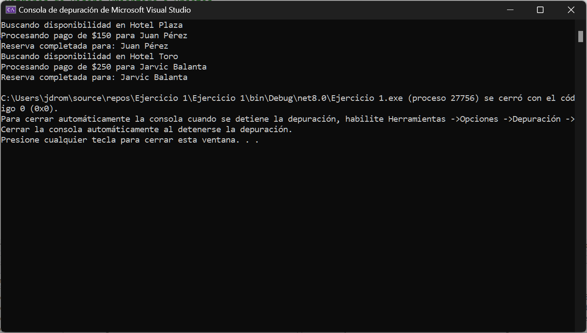

# 📘 Patrones de Diseño Orientado a Objetos - Ejercicio 1  

## 🏫 Curso: Patrones de Diseño - UCC - 2025  
**👨‍🏫 Docente:** Harold Adrián Bolaños Rodríguez  

---

## 📌 Descripción  
Este repositorio contiene la solución al **Ejercicio 1** del curso de **Patrones de Diseño Orientado a Objetos**.  

### 📂 Contenido  
- **Archivos C#** 📂 → Código fuente del ejercicio.  
- **Captura de funcionamiento** 📸 → Imagen demostrativa de la ejecución.  
- **Respuesta en Word** 📝 → Documento word donde se encontrara la respuesta a los ejercios en clase.  

---

## 📂 Estructura del Repositorio  
